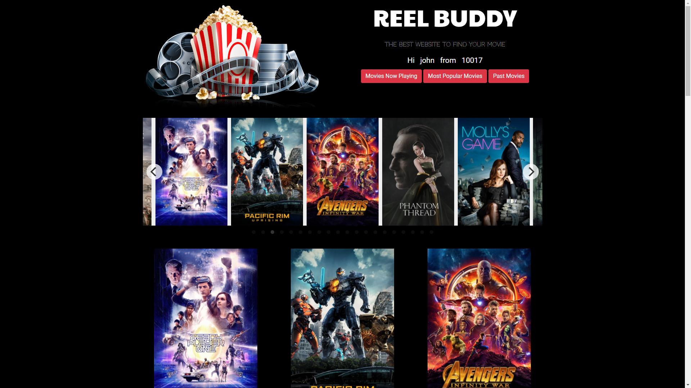
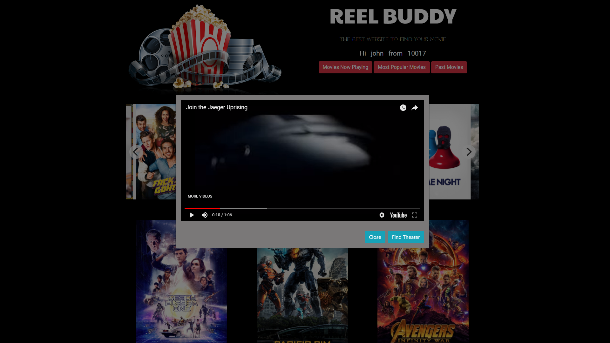
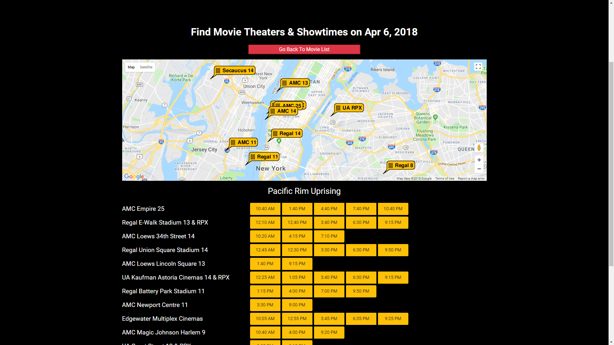

# Register and Search The Movies Being Played In Your Area

<h1><strong>Reel Buddy Movie Search Webiste</strong></h1>

<h2>Live View --> https://s3.amazonaws.com/reel-buddy/index.html

<h2><strong>Screen Shots</strong></h2>: 

 
    

    

    

    

    

    

<h2><strong>Technologies Used</strong></h2>: 
<ul>
    <li>HTML</li>
    <li>CSS and Flickity CSS</li>
    <li>Bootstrap 4(Modal, animations)</li>
    <li>JavaScript, jQuery</li>
    <li>aJax and three apis(tms api,the movie db api and google map api)</li>  
    <li>Firebase for user registration,login and persistant storage related with registered user</li>
</ul>  

<h2><strong>Prerequiremnt</strong></h2>: None.

<h2><strong>How to Run</strong></h2>: 
<ol>
    <li> click the Live View link above or 
    <li> clone this file directly to local repository or just simply download the code;
    <li> locate the index.html file, double click and your defaul browser shall automatically open the login page.
    <li> register the website (zipcode needed) or login in with an email address and password. 
    <li> Once registered or logged in, click movies in show options to list all the movies in play.
    <li> Click the image to open the video trailer window.
    <li> If interested, click "Find Theater" button and it will list all the movie theater around your registed zipcode and the show times for selected movie.
</ol>

<h2><strong>Deployed With</strong></h2>: 
<ul>
    <li> AWS S3 hosted website. 
</ul>

Enjoy!